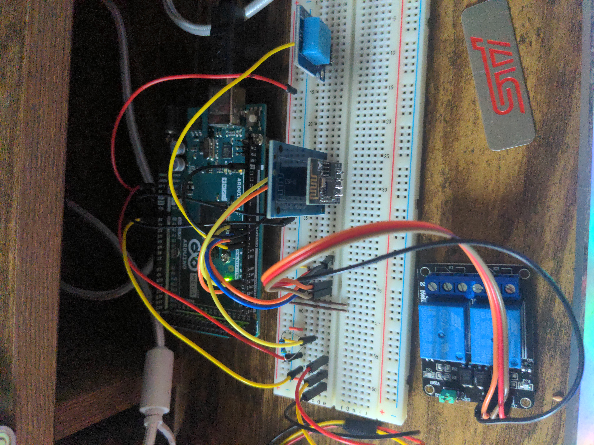
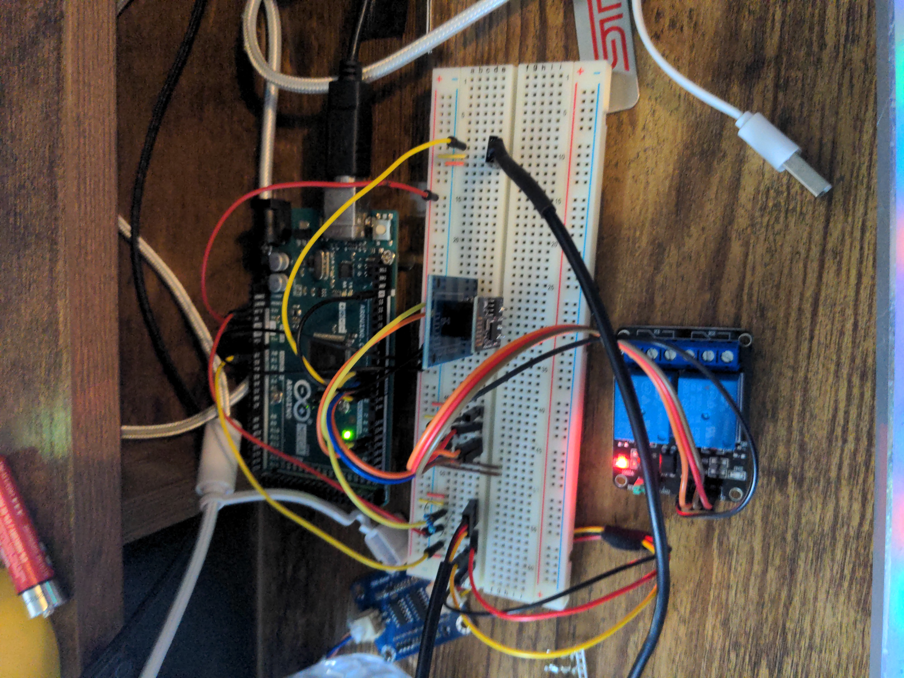

# Mega Garden

This uses an Arduino Mega 2650
 - 1 DS18B20  Sensor
 - 1 DHT11 Sensor
 - 1 Dual channel mechnical Relay
 - 1 Solid State Relay
 - 1 TDS Meter 1.0 Sensor
 - 1 ESP-01 Wifi Module (flashed with AT firmware v1.7.4)

## The Problem
I keep killing plants, I need to maintain automated functions even in the even of Network failure All automation needs to be self contained and perameters need to be subscribed to(MQTT) and saved(EEPROM) in the even to power loss or network failure.

# Mega Garden

This uses an Arduino Mega 2650
 - 1 DS18B20  Sensor
 - 1 DHT11 Sensor
 - 1 Dual channel mechnical Relay
 - 1 Solid State Relay
 - 1 TDS Meter 1.0 Sensor
 - 1 ESP-01 Wifi Module (flashed with AT firmware v1.7.4)

## The Problem
I keep killing plants, I need to maintain automated functions even in the even of Network failure All automation needs to be self contained and perameters need to be subscribed to(MQTT) and saved(EEPROM) in the even to power loss or network failure.

## Pictures

  
  

  
  

