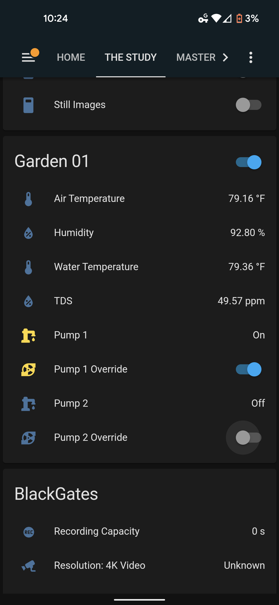

# Mega Garden

This uses an Arduino Mega 2650
 - 1 DS18B20  Sensor
 - 1 DHT11 Sensor
 - 1 Dual channel mechnical Relay
 - 1 Solid State Relay
 - 1 TDS Meter 1.0 Sensor
 - 1 ESP-01 Wifi Module (flashed with AT firmware v1.7.4)

## The Problem
I keep killing plants! I need to maintain automation even in the event of network failure. All automations need to be self contained and perameters need to be subscribed to via MQTT and saved in the EEPROM.

## Hardware
This uses an Arduino Mega 2650
 - 1 DS18B20 Sensor
 - 1 DHT11 Sensor
 - 1 Dual channel mechnical Relay
 - 1 Solid State Relay
 - 1 TDS Meter 1.0 Sensor
 - 1 ESP-01 Wifi Module (flashed with AT firmware v1.7.4)

### pinouts
#### Power
  - \<gnd\> \<-\> \<gnd-bus\>
  - \<5v\> \<-\> \<5v-bus\> 
#### Analog
  - \<A01\> \<-\> \<DHT11 Sensor\> 
#### Digital
  - \<2\> \<-\> \<TDS Meter 1.0 Sensor\>
  - \<3\> \<-\> \<Mechnical Relay A\>
  - \<4\> \<-\> \<Mechnical Relay B\>
  - \<5\> \<-\> \<DS18B20 Sensor\>
  - \<6\> \<-\> \<Solid State Relay A\>
  - \<7\> \<-\> \<Solid State Relay B\> 
#### Serial
  - \<16 tx2(serial2)\> \<-\> \<ESP-01 rx\>
  - \<17\> rx2(serial2) \<-\> \<ESP-01 tx\> 

### Compile
Use ATmega2560 environment, Uno would reqire Soft Serial and 9600 baud to the ESP-01
ESP-01 must have AT firmware v1.7.4
change the ./includes/secrets.h.sample to match your network.

## todo
 - finsh pulling epoch time conversion so as to not write to EEPROM the date but only the saved times.
 - wire in a RTC module (DS3231) to be able to maiuntain time without the aid of NTP on powerloss without internet
 - start design of PCB (mega2650 protoboard at the very least)
 - wire in PH sensor and program thresholds for pH adjustment via DC motors or relay(AC)

## Pictures

  
  

  
  

